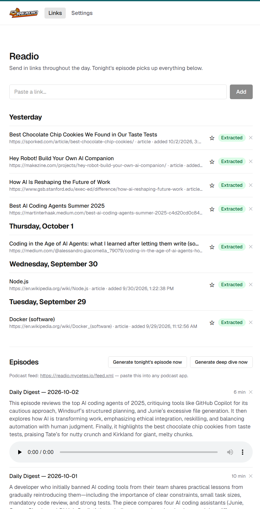

Auto-generates a personal podcast from links sent throughout the day. Solves
the "tab graveyard" problem: articles/videos you want to get to but never
do, forgotten by evening or lost to a browser restart.

Send in a link whenever you find something (paste it into the web UI, or
use the browser extension). Every evening, a batch job clusters that day's
content, writes a script that transitions between topics, and turns it
into a single audio episode — ready to listen to the next morning via a
private podcast RSS feed, in any podcast app. Star anything you want to
come back to for a longer, deeper Saturday episode.



## Quick start (Docker, with the defaults)

The defaults need no paid API key: [Open WebUI](https://github.com/open-webui/open-webui)
(or [Ollama](https://ollama.com) directly) for AI, and the self-hosted
Kokoro-82M model for text-to-speech — both run on your own hardware.

```bash
git clone https://github.com/lawrenal/Readio.git
cd Readio
cp .env.docker.example .env
```

Edit `.env` and set `OPENWEBUI_BASE_URL` (and `OPENWEBUI_MODEL`) to point
at your own Open WebUI instance.

```bash
docker compose up --build   # builds the image locally from source
# or, once an image has been published (see .github/workflows/docker-publish.yml):
docker compose up           # pulls ghcr.io/OWNER/readio:latest instead — no local build
```

Open `http://<host>:3000`, paste in a link, then either wait for the
nightly run (9pm local time by default) or click "Generate tonight's
episode now." Subscribe to `http://<host>:3000/feed.xml` in any podcast
app to listen.

Everything persistent (SQLite db, generated audio, the downloaded Kokoro
model) lives under `./data/` via a bind mount, so rebuilding/restarting
the container never loses data.

Prefer a cloud AI/TTS provider instead, or want to run it natively on a
Mac without Docker? See [docs/ai-providers.md](./docs/ai-providers.md)
and [docs/tts-providers.md](./docs/tts-providers.md).

## How it works

1. Send in content during the day (paste a link, browser extension).
2. It's extracted and summarized as it arrives.
3. Every evening, a batch job clusters that day's content, writes a
   script, and turns it into a single audio episode (≤45 min).
4. Star anything you want to revisit — starred items build up until
   Saturday, when a separate, longer (≤90 min) deep-dive episode covers
   just those, going further into each one since there's more time and
   fewer items.
5. Listen via the private podcast RSS feed in any podcast app, or
   straight from the web UI's inline player.

## Documentation

- [AI providers](./docs/ai-providers.md) — Open WebUI, Ollama, Anthropic, OpenAI, xAI, Gemini
- [Text-to-speech providers](./docs/tts-providers.md) — Kokoro (local + remote), ElevenLabs, Azure, Google, Gemini
- [Remote Kokoro / mlx-audio setup](./docs/remote-kokoro-setup.md) — offload synthesis to Apple Silicon hardware
- [Editable prompts](./docs/prompts.md) — customize how scripts/summaries are written
- [Scheduling](./docs/scheduling.md) — nightly generation, the Saturday deep dive, retention
- [Security](./docs/security.md) — password-protecting a public deployment, encrypting stored API keys
- [Architecture](./docs/architecture.md) — how the whole thing is actually built, stack, pipeline

`npm test` runs the unit test suite (pure logic only — URL normalization,
RSS feed shape, template fallbacks, chunking strategies, settings
encryption; nothing that needs network or API access).

## License

[PolyForm Noncommercial 1.0.0](./LICENSE.md) — free to use, modify, and
self-host for any noncommercial purpose. Commercial use requires
contacting the licensor for a separate license.
